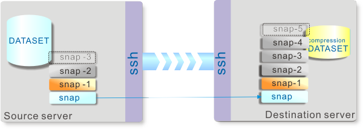

# ZRM2
Zfs Remote mirror Manager 2

## Description
ZRM2は、zfsデータセットのバックアップ世代管理スクリプトです。  
Solaris環境でバックアップ世代を管理するために使用してきたシェルスクリプトの仕様をベースに、pythonで一から書き起こしたものです。

ZRM2は、iniファイル形式の設定ファイルにてバックアップ仕様を指示します。
これにより定期的なバックアップの手続きを、単純化出来ます。

もっとも単純な実行方法は以下のような感じです。  
    zrm.py -p backup.zrm

## Usage
コマンドラインオプション

　　　optional arguments:
　　　　  -h, --help            show this help message and exit
　　　　  -1, --one             Send an only newest snapshot on the sending for fast
　　　　                        relationship repair
  　　　　-e, --exist           Send existing snapshots for cascading mirror
  　　　　-l, --logheader       log Header
  　　　　-k, --keep            Keep old snapshots of destination without being
  　　　　                      destloyed for cascading mirror
  　　　　-r REMARK, --remark REMARK
                        Remark
  　　　　-s, --snap            only create a new Snapshot(no send)
  　　　　-t, --temp            send Temporary snapshot. It doesn't count as a
      　　　　                  generation.
  　　　　-p PARFILE, --parfile PARFILE
      　　　　                  Parameter-file
  　　　　-v, --verbose         Verbose message

バックアップ設定ファイル(.zrm)
